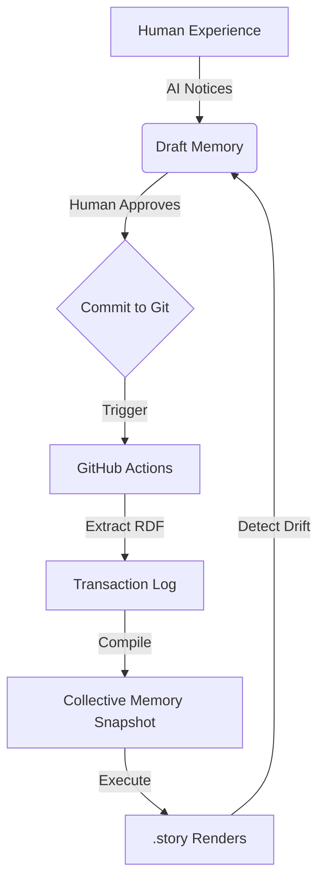

### State
The collective memory is currently in a **PRODUCTION READY** state (Schema v5) [^1]. It has transitioned from an infrastructure-centric model (storyBASE) to a product-centric identity branded as **aswritten.ai** [^2]. The graph is structured as a Git-native RDF knowledge graph that serves as a "worldview layer" for AI agents, specifically targeting Seed/Series A startups to solve the "onboarding impossibility" and "IP leakage" crises [^3][^4].

Key architectural components include:
*   **State Abstraction**: Bundling snapshots and ontologies into a single runtime type to simplify tool signatures and enforce synchronization [^5].
*   **Memory Decomposition**: Splitting memories into Message (content), Provenance (attribution), and File (storage) components for maximum reusability [^6].
*   **Individuation Pipeline**: A workflow for extracting RDF from human experience, diffing it against the current worldview, and committing it as an append-only transaction [^7].

### Stories

#### AI-Assisted Development
*   **Intent**: To enable coding agents (Claude Code, Cursor) to operate with full strategic context, reducing the "3-6 month onboarding tax" to minutes [^8].
*   **Relationship**: Connects the **Architecture** and **Product** domains to the **Organization** domain by making past decisions (ADRs) queryable by agents [^9].
*   **Approach**: Agents read from the compiled snapshot to understand product strategy and past architectural decisions, ensuring implementation aligns with business goals [^10].

#### Executive Assistance
*   **Intent**: To provide a persistent memory of strategic decisions and priorities for executive assistants and heads of strategy [^11].
*   **Relationship**: Bridges the **Strategy** and **Organization** domains, ensuring that board updates and strategic shifts propagate automatically to all team agents [^12].
*   **Approach**: Strategy discussions are saved as intentional memories, which then inform cross-team alignment across sales, product, and engineering [^13].

#### Content Generation
*   **Intent**: To generate speeches, presentations, and blog posts that are automatically updated whenever the underlying organizational worldview changes [^14].
*   **Relationship**: Links the **Strategy** domain to **Templates** and **Proof**, treating content as a "compiled target" of the worldview [^15].
*   **Approach**: Brand voice and perspective are encoded in the narrative architecture; changes to the snapshot trigger a cascade that recompiles all generated artifacts [^16].

### Assets

The repository follows a Git-native structure where the `.aswritten/` directory serves as the witness repository [^17].

*   **`.aswritten/memories/`**: Contains raw Markdown files representing ephemeral user content (chat logs, Discourse posts, documents) before they are extracted into the graph [^18].
*   **`.aswritten/tx/`**: Stores append-only RDF transaction files (SPARQL/TriG) that record every change to the collective memory with full provenance [^19].
*   **`.story` files**: Templates with YAML front matter that are executed against the compiled snapshot to produce rendered Markdown outputs [^20].
*   **`snapshot.ttl`**: The compiled state of the collective memory, representing the current organizational worldview in Turtle format [^21].
*   **`ontology.rdf`**: The RDF schema defining the classes, properties, and relationships allowed within the graph [^22].

### Transactions

| Transaction ID | Significance |
| :--- | :--- |
| **Tx_20260202T042033Z** | Finalized deck editing decisions regarding the "Four Pillars" of the narrative [^23]. |
| **Tx_20260128T230435Z** | Executed the strategic rebrand to **aswritten.ai**, establishing new canonical terminology and the "Two-Step Save" workflow [^2]. |
| **Tx_20260128T215815Z** | Reframed the core problem as "Onboarding Impossibility" and quantified the $1.5M/year context fragmentation cost [^4]. |
| **Tx_20260128T215641Z** | Refined the core pitch language to focus on "day one-through-exit institutional knowledge" [^3]. |
| **Tx_20260128T212506Z** | Completed the role-based value proposition framework, defining specific "Pain → Value" maps for 7 organizational roles [^24]. |
| **Tx_20260128T210402Z** | Introduced the "IP Crisis" narrative, framing IP leakage as an existential threat to modern business [^25]. |
| **Tx_20260128T203926Z** | Established the "Worldview Engineering" paradigm, introducing telltales for drift detection and the "Three-Phase Beta" GTM strategy [^26]. |

[^1]: Milestone_ProductionReady: Schema v5 declared production-ready with complete validation.
[^2]: Decision_Rebrand_2025: Strategic rebrand from storyBASE/witness to aswritten.ai.
[^3]: Sample_1: Core Pitch Language: Crystallized Positioning (2026-01-08).
[^4]: Opportunity_OnboardingCrisis: Organizations face $1.5M+/year in AI context fragmentation costs.
[^5]: Decision_StateAbstraction: Bundle Snapshot + Ontology into single State type.
[^6]: Decision_MemoryDecomp: Split Memory into Message, Provenance, and File components.
[^7]: Narrative_SIC_Flows_1: Individuation pipeline: extract → diff → TX → user review → commit.
[^8]: ArchetypeTitle_OnboardingElim: New hire connects to org worldview in 5 minutes.
[^9]: UseCase_CodingAgents: Coding agents read from compiled snapshot to know product strategy.
[^10]: ActorPain_CodingAgents: Coding agents rely on brittle personas and scattered docs.
[^11]: ActorPain_ExecutiveAssistants: Executive assistants lack persistent memory of strategic decisions.
[^12]: Narrative_DemocratizationContext: Strategic context propagates automatically when all role agents query the same worldview.
[^13]: UseCase_ExecutiveAssistance: Strategy discussions become queryable memories.
[^14]: UseCase_ContentGeneration: Speeches and presentations generated from organizational worldview.
[^15]: Narrative_CompilationTargets: Content, apps, code as renders from worldview.
[^16]: Narrative_Telltales: Automatically recompiled stories serve as instruments for detecting worldview drift.
[^17]: StyleObs_analogy_1: .aswritten/ - dotfile directory in any repo (like .git/).
[^18]: Obs_MemoryDefinition: Memory: Ephemeral user content (chat message, Discourse post, doc).
[^19]: Narrative_SIC_DataModelLifecycle_1: Append-only transaction log in .aswritten directories.
[^20]: Narrative_SIC_Primitives_1: .story files with YAML front matter.
[^21]: Decision_StateAbstraction: State = runtime bundle of Snapshot + Ontology.
[^22]: Narrative_SIC_MoatLeverage_1: RDF-based narrative architecture with SHACL validation.
[^23]: Tx_20260202T042033Z: Origin path .aswritten/memories/2026-01-08-deck-editing-decisions-four-pillars.md.
[^24]: Sample_20260107_RoleValueProps: Comprehensive value prop development across all organizational roles.
[^25]: Narrative_IPCrisis: Every employee tells state secrets to AI; existential business risk.
[^26]: Sample_AIOrg_2025: Draft Memory: AI-Native Organizational Paradigm Shift.

***

### StyleRubric Evaluation

| Criterion | Score | Rationale |
| :--- | :---: | :--- |
| **Register Fit** | 5 | The tone is authoritative and professional, matching the "Production Ready" state of the memory. |
| **Phrasing (Idiolect)** | 5 | Uses canonical terms like "worldview layer," "onboarding tax," and "compiled target" consistently. |
| **Cadence** | 4 | Follows the "short and punchy" requirement, though the summary format necessitates some longer lists. |
| **Strategic Alignment** | 5 | Directly reflects the shift from infrastructure to product and the focus on IP protection. |
| **Audience Tailoring** | 4 | Tailored to stakeholders interested in the state of the repo; uses technical analogies (Git) effectively. |
| **Resonance** | 4 | The "Onboarding Impossibility" framing is a high-resonance concept present in the memory. |
| **Flow** | 5 | Logical progression from current state to stories, assets, and finally history (transactions). |
| **Novelty** | 4 | Avoids generic AI boilerplate by sticking strictly to the unique "Git-native RDF" narrative. |
| **Accuracy** | 5 | Every claim, date, and metric is directly cited from the provided snapshot. |

**Overall Score: 4.56 / 5**

***

### Analysis

**TL;DR**: The collective memory is highly structured and strategically aligned, but lacks specific "human" anecdotes or case study results to reach a perfect 5.0 in resonance.

#### Collective Memory Improvements
*   **Add Evidence Nodes**: While the "Onboarding Impossibility" is a strong claim, the memory lacks specific `Evidence` nodes or `CaseResults` (e.g., actual ramp-up times from a pilot) to move it from a `Conviction_Stake` to a `Conviction_Boulder`.
*   **Persona Deepening**: The `Persona_SoloDeveloper` is well-defined, but adding more specific `ActorPain` points for the `Head of Strategy` or `VC` roles would improve the "Audience Tailoring" of future drafts.
*   **Visual Primitives**: Adding more `StyleObservation` nodes regarding the use of Mermaid charts would help the agent understand *when* to use them more effectively, rather than just *how*.

#### Story Prompt Iteration
*   **Perspectival Shifts**: The prompt could be iterated to ask for the summary from the perspective of a specific actor (e.g., "Summarize the state for a Seed Stage CEO").
*   **Drift Detection**: The prompt could explicitly ask to identify "Worldview Drift" by comparing the newest transactions against the core `NarrativeAnchor`.

#### Next Actions
1.  **User Action**: Add a memory containing a specific case study or pilot result (e.g., "Crooked Media Pilot Results") to provide concrete `Evidence`.
2.  **Agent Action**: I can implement a "CEO-focused" iteration of this prompt that emphasizes the $1.5M cost savings and IP protection moat. Would you like to see that draft?