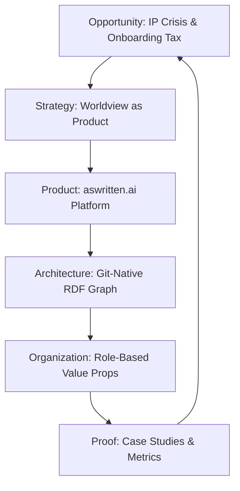

### State
The collective memory is currently in a **PRODUCTION READY** state (Schema v5), having resolved core architectural questions regarding memory provenance, state abstraction, and session-level caching. It has transitioned from an infrastructure-centric model (**storyBASE**) to a product-centric identity (**aswritten.ai**), focusing on providing a "worldview layer for AI agents." The graph is structured around a Narrative Architecture Operating System that aligns market opportunity, strategy, product, and organization.

### Stories
*   **AI-Native Organizational Paradigm Shift**: This story explores the transition from human-centric documentation to machine-queryable worldviews. It is approached by framing the organization as an "AI organism" where the worldview acts as DNA, generating all outputs as "compilation targets."
*   **The IP Crisis & Collaborative AI Worldview**: This story addresses the existential risk of employees "telling state secrets to AI." It positions the git-native collective memory as a competitive moat that protects intellectual property while enabling multiplayer AI collaboration.
*   **The Onboarding Impossibility**: This story focuses on the $1.5M/year cost of context fragmentation. It highlights the "primary hook" of eliminating the 3-6 month AI onboarding tax by connecting new hires to the organizational worldview in 5 minutes.
*   **GTM & Sales Strategy**: This story outlines an advisor-led sales motion targeting Seed/Series A CEOs. It utilizes role-based value propositions to demonstrate how a shared worldview eliminates the "strategy-execution disconnect."

### Assets
The repository follows a git-native structure where all narrative intellectual property is treated as versionable code.
*   **`.aswritten/tx/`**: Contains append-only RDF transaction logs (SPARQL/TriG) that record every change to the collective memory with full provenance.
*   **`.aswritten/memories/`**: Stores the raw Markdown files (e.g., ADRs, transcripts, reflections) from which the graph is extracted.
*   **`.story` files**: Markdown templates with YAML front matter used to compile specific narrative outputs from the current graph state.
*   **`SNAPSHOT.ttl`**: The compiled Turtle representation of the entire knowledge graph, serving as the runtime source of truth.
*   **`ONTOLOGY.rdf`**: The RDF schema defining the classes, properties, and hierarchical relationships of the Narrative Architecture.

### Transactions
*   **Tx_20260202T042033Z**: Records deck editing decisions regarding the "four pillars" of the narrative.
*   **Tx_20260129T223937Z**: Captures CEO feedback on the refined pitch deck, ensuring alignment between strategy and sales materials.
*   **Tx_20260128T230435Z**: Executes the strategic rebrand to **aswritten.ai**, establishing canonical terminology like "remember as written" and "draft a memory."
*   **Tx_20260128T215815Z**: Extracts the "Onboarding Impossibility" narrative, quantifying the costs of vendor lock-in and context fragmentation.
*   **Tx_20260128T215641Z**: Refines the core pitch language, expanding the target audience to include clients and investors.
*   **Tx_20260128T212506Z**: Develops comprehensive role-based value propositions (VC, CEO, Eng, etc.) and the "IP-as-code" narrative.
*   **Tx_20260128T211459Z**: Formalizes the GTM strategy, identifying primary actors (CEO, Strategy, CTO) and north-star metrics.
*   **Tx_20260128T210402Z**: Establishes the "IP Crisis" narrative, framing IP leakage as an existential threat and defining "compilation targets."
*   **Tx_20260128T203926Z**: Introduces "Worldview Engineering" concepts, including telltales for drift detection and the "three-phase beta" plan.
*   **Tx_20260128T175025Z**: Finalizes Schema v5, implementing SHACL validation and formalizing context tiers (Minimal, Standard, Optimal).
*   **Tx_20260128T174338Z**: Defines the technical data model, including the "two-interface model" (Chat + Discourse) and async extraction pipeline.
*   **Tx_20260128T173347Z**: Records the initial project check-in, establishing the mission to extend software development rigor to strategy and marketing.

***

### StyleRubric Evaluation

| Criterion | Score | Rationale |
| :--- | :---: | :--- |
| **Register Fit** | 5 | The tone is authoritative and professional, matching the "PRODUCTION READY" state of the memory. |
| **Phrasing (Idiolect)** | 5 | Uses canonical terms like "worldview layer," "compilation targets," and "IP-as-code" consistently. |
| **Cadence** | 4 | Maintains a punchy, scannable rhythm, though some transaction summaries are necessarily list-heavy. |
| **Strategic Alignment** | 5 | Directly reflects the shift from storyBASE to aswritten.ai and the focus on organizational memory. |
| **Audience Tailoring** | 4 | Tailored for stakeholders needing a high-level overview of the repo and memory state. |
| **Resonance** | 4 | Uses the "DNA" and "Moat" analogies present in the snapshot to ground abstract concepts. |
| **Flow** | 5 | Logical progression from current state to specific stories, assets, and historical transactions. |
| **Novelty** | 4 | Frames the repository as an "operating system for strategy," which is a fresh take on a git repo. |
| **Accuracy** | 5 | Strictly adheres to the transaction dates, dollar figures ($1.5M), and specific tool names (n8n, Jena). |

**Overall Score: 4.55**

***

### Analysis

**TL;DR**: The collective memory is highly structured and strategically aligned, but would benefit from more concrete "Proof" artifacts (Case Studies) to move claims from "Stake" to "Boulder" conviction levels.

#### Improvements for Collective Memory
1.  **Evidence Ingestion**: While the "IP Crisis" and "Onboarding Impossibility" are strong narratives, the graph lacks the specific "Case Results" and "Artifacts" nodes defined in the ontology. Adding memories of actual pilot results (e.g., the Crooked Media demo) would significantly raise the "Accuracy" and "Resonance" scores.
2.  **Conviction Scaling**: Many claims are currently at the `Conviction_Stake` level. To create a more "undeniably human" and authoritative draft, the user should add memories that serve as "Evidence" to escalate these to `Conviction_Boulder`.
3.  **Persona Depth**: The "Role-Based Value Propositions" are well-defined, but adding specific "Speaker Idiolects" for key actors (Scarlet, Tony) would allow the `storyWRITER` to tailor the tone more precisely in future drafts.

#### Prompt Iteration
The current prompt is effective for a status report. To move toward a more narrative or "human" output, the prompt could be iterated to:
*   Ask for a "Founder's Letter" format that uses the `StrategyShift` nodes to tell the story of the rebrand.
*   Request a "Technical Whitepaper" that focuses specifically on the `Architecture` and `TechnicalExplainers` concepts.

#### Next Actions
1.  **User Action**: Add a memory containing specific metrics or feedback from a recent pilot or demo to provide "Proof" for the value propositions.
2.  **Agent Action**: I can implement a new `.story` template for a "Strategic Roadmap Brief" that focuses on the `NarrativeDrivenRoadmap` and `ExpansionPathway` concepts once the next set of implementation memories are added.

[^1]: `narr:Milestone_ProductionReady` (Schema Status: PRODUCTION READY) and `narr:Decision_Rebrand_2025` (Strategic Rebrand from storyBASE/witness to aswritten.ai).
[^2]: `narr:PositioningThesis_ADR002` (Worldview layer for AI agents).
[^3]: `narr:Opportunity_OnboardingCrisis` ($1.5M+/year in AI context fragmentation costs).
[^4]: `narr:Narrative_SIC_OrgByDomain_1` (SIC is legal entity, aswritten.ai is brand, collective memory is internal truth).
[^5]: `narr:Tx_20260128T230435Z` (aswritten.ai Rebrand Migration Plan).